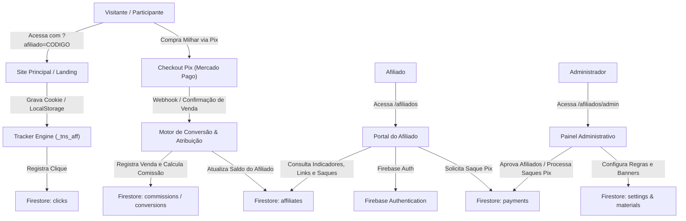
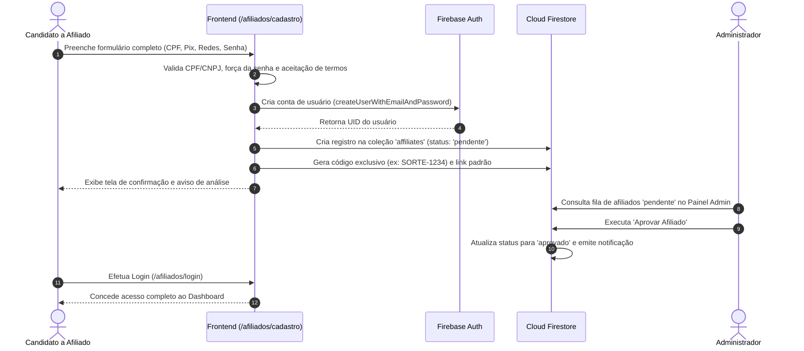
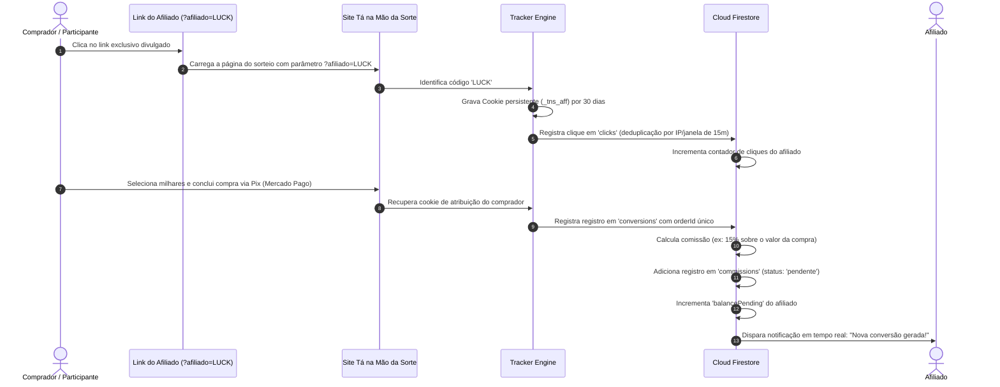
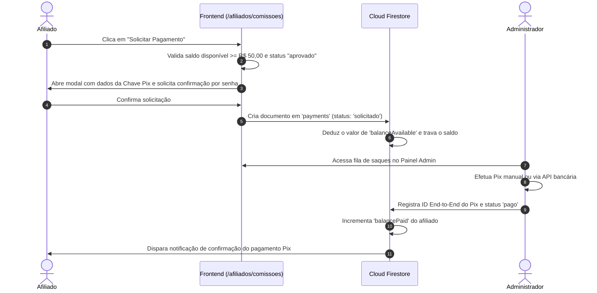

# Plano de Implementação: Portal de Afiliados — Tá na Mão da Sorte

Este documento apresenta o planejamento completo, arquitetura de software, especificações de design system, modelo de banco de dados, fluxos de usuário, regras de segurança e etapas de execução para o **Portal de Afiliados do Tá na Mão da Sorte** ([tanamaodasorte.com.br](https://tanamaodasorte.com.br)).

---

## 1. Análise da Identidade Visual e Design System

Com base na engenharia reversa e extração direta dos estilos, componentes e assets do site oficial `https://tanamaodasorte.com.br`:

### 1.1 Paleta de Cores
- **Fundo Principal (Dark Mode de Alta Performance)**:
  - Base: `#020617` (`slate-950`)
  - Cards e Contêineres: `#0f172a` (`slate-900`) com fundos semi-transparentes (`bg-slate-950/80`, `bg-slate-950/60`, `bg-slate-900/90`)
  - Bordas Sutis: `border-slate-800`, `border-emerald-900/40`, `border-emerald-500/30`
- **Cor Primária (Sorte / Ação / Lucro)**:
  - Emerald Spectrum: `#059669` (Theme Color), `emerald-400` (`#34d399`), `emerald-500` (`#10b981`), `emerald-600` (`#059669`), `emerald-950`
  - Gradiente de Ação: `bg-gradient-to-r from-emerald-400 via-emerald-500 to-green-600 hover:from-emerald-300 hover:to-green-500` com texto escuro `text-slate-950 font-black`
- **Cor Secundária (Prêmio / Fortuna / Destaque)**:
  - Gold & Amber Spectrum: `#f59e0b` (`amber-400`, `amber-500`, `yellow-400`, `yellow-500`)
  - Gradiente Ouro: `bg-gradient-to-br from-amber-400 to-yellow-600`
  - Utilizado em saldos pendentes, alertas de comissão, destaques de premiação acumulada e badges VIP.
- **Cor Terciária / Tecnológica (Métricas / Rastreamento / Links)**:
  - Cyan Spectrum: `#06b6d4` (`cyan-400`, `bg-cyan-950/60`, `border-cyan-800/40`)
  - Utilizado para parâmetros UTM, links de afiliados, códigos e badges informativas.
- **Cor de Alerta / Ao Vivo / Erro**:
  - Red Spectrum: `#ef4444` (`red-500`, `bg-red-600/20`, `text-red-400`, `border-red-500/30`)
  - Utilizado para cancelamentos, estornos, erros de validação e desativações.

### 1.2 Tipografia
- **Família Sans**: Geist Sans (`font-sans`), tipografia limpa, geométrica e altamente legível para textos corridos, títulos e botões.
- **Família Mono**: Geist Mono (`font-mono`) com espaçamento tabular para exibição de valores em Reais (`R$ 1.250,00`), taxas de conversão (`3.8%`), códigos de afiliados (`SORTE777`), chaves Pix e identificadores.
- **Pesos e Estilos**: `font-medium`, `font-bold`, `font-extrabold`, `font-black`, com caixas altas pontuais em badges e subtítulos (`uppercase tracking-wider text-[10px]`).

### 1.3 Componentes e Estilo Visual
- **Logotipo Oficial**:
  - Ícone: Contêiner arredondado (`rounded-xl sm:rounded-2xl`) com gradiente `from-emerald-400 via-emerald-600 to-green-800`, borda `border-emerald-300/30`, sombra `shadow-emerald-500/25`, trevo `🍀` centralizado e ponto de pulso âmbar animado (`animate-ping`).
  - Tipografia da Marca: `Tá Na Mão da SORTE` com gradiente de texto `bg-gradient-to-r from-emerald-300 via-yellow-300 to-amber-400 bg-clip-text text-transparent`.
  - Subtítulo: `"Bingo & Loteria Digital • Sorteios Diários às 19h • R$ 2,00 a Milhar"`.
- **Botões**:
  - **Botão Primário (CTA)**: `rounded-xl py-2.5 px-4 font-black text-slate-950 bg-gradient-to-r from-emerald-400 via-emerald-500 to-green-600 shadow-md shadow-emerald-500/30 active:scale-95 transition-all cursor-pointer`.
  - **Botão Secundário / Ghost**: `rounded-xl py-2 px-3.5 font-bold text-emerald-400 border border-emerald-500/30 bg-emerald-950/40 hover:bg-emerald-500/10 transition-all`.
  - **Botão Âmbar / Pagamento**: `rounded-xl font-black text-slate-950 bg-gradient-to-r from-amber-400 to-yellow-500 shadow-md shadow-amber-500/20 active:scale-95`.
- **Cards e Modais**:
  - Cantos amplos: `rounded-2xl` e `rounded-3xl`.
  - Efeito vidro / desfoque: `backdrop-blur-md bg-slate-950/90`.
  - Sombras profundas: `shadow-2xl shadow-emerald-950` e `shadow-lg shadow-black/60`.
- **Campos de Entrada (Inputs)**:
  - `bg-slate-950 border border-emerald-900/60 rounded-xl px-3.5 py-2.5 text-white placeholder:text-slate-500 focus:outline-none focus:border-emerald-400 font-sans transition-colors`.

### 1.4 Tom de Comunicação
- Profissional, transparente, energético e convidativo.
- Foco em geração de renda com transparência total: *"Indique amigos e seguidores para o maior bingo e loteria digital diária do Brasil e receba comissões automáticas direto no seu Pix!"*.
- Totalmente localizado para o Português do Brasil (pt-BR).

---

## 2. Objetivo do Projeto

Construir uma plataforma completa, profissional, responsiva e segura de afiliação integrada ao ecossistema do **Tá na Mão da Sorte**, acessível na rota `/afiliados` (e `/area-do-afiliado`), oferecendo:
1. **Página pública de conversão** de novos afiliados com calculadora de ganhos e FAQ.
2. **Onboarding completo e seguro** com formulário de cadastro validado (CPF/CNPJ, WhatsApp, Chave Pix, canais).
3. **Autenticação robusta** com recuperação de senha e proteção contra força bruta.
4. **Painel do Afiliado** intuitivo com indicadores em tempo real, gráficos de desempenho, links exclusivos, central de materiais, extrato de comissões e solicitação de saque Pix.
5. **Mecanismo de Rastreamento Anti-Fraude** com cookies de 30 dias, atribuição de cliques, prevenção contra compras próprias e detecção de duplicidades.
6. **Painel Administrativo Restrito** para moderação de afiliados, configuração de regras de comissionamento, aprovação e controle de saques Pix, upload de materiais e auditoria de ações.
7. **Conformidade com a LGPD** com registro de consentimento, termos de uso, política de privacidade e exportação/anonimização de dados.

---

## 3. Funcionalidades Detalhadas

### 3.1 Páginas Públicas (`/afiliados`)
- **Hero Section**:
  - Headline de alto impacto: *"Programa de Afiliados Tá na Mão da Sorte - Transforme sua audiência em comissões diárias no Pix"*.
  - CTAs destacados: `"Quero ser afiliado"` (leva ao cadastro) e `"Já sou afiliado"` (leva ao login).
- **Métricas e Benefícios**:
  - Comissões de até 25% por bilhete vendido.
  - Pagamentos rápidos via Pix sem burocracia.
  - Acompanhamento em tempo real de cliques e conversões.
  - Materiais prontos e otimizados para Instagram, TikTok e WhatsApp.
- **Passo a Passo Visual (Timeline interativa)**:
  1. *Faça seu cadastro* (rápido e gratuito)
  2. *Aguarde a aprovação* (análise rápida para garantir a segurança da rede)
  3. *Divulgue seu link exclusivo* (nas suas redes, stories e grupos)
  4. *Acompanhe suas indicações* (dashboard em tempo real)
  5. *Receba suas comissões* (direto no seu Pix)
- **Calculadora Interativa de Projeção de Ganhos**:
  - Slider de bilhetes diários indicados e taxa de comissão configurável, calculando ganho diário, semanal e mensal estimado.
- **Perguntas Frequentes (FAQ Acordeon)**:
  - Dúvidas sobre comissões, prazos de pagamento, regras de divulgação, requisitos de idade (+18).
- **Regulamento Oficial, Termos de Uso e Política de Privacidade**:
  - Modal com o texto integral das normas da plataforma e adequação à LGPD.

### 3.2 Cadastro de Afiliado (`/afiliados/cadastro`)
- Formulário progressivo e responsivo com validação em tempo real:
  - **Dados Pessoais/Empresariais**: Nome Completo, CPF ou CNPJ (validação oficial de dígito verificador), Data de Nascimento (bloqueio para menores de 18 anos).
  - **Contato**: E-mail (validação de formato e verificação de duplicidade), Telefone, WhatsApp (máscara automática `(00) 00000-0000`).
  - **Localização**: Cidade e Estado (UF).
  - **Segurança**: Senha e Confirmação de Senha (medidor de força: mínimo 8 caracteres, maiúscula, número e caractere especial).
  - **Dados Bancários Pix**: Tipo de Chave (CPF, CNPJ, E-mail, Celular, Aleatória) e Chave Pix.
  - **Perfil de Divulgação**: Principais redes sociais (Instagram, TikTok, YouTube, Grupos) e descrição de como pretende divulgar.
  - **Termos de Consentimento (LGPD)**: Checkboxes obrigatórios com link para termos de uso e política de privacidade.
- Fluxo de Submissão:
  - Criação da conta no Firebase Auth.
  - Registro do afiliado com status `"pendente"` no Firestore.
  - Tela de sucesso informativa explicando o processo de análise cadastral e envio de e-mail de confirmação.

### 3.3 Autenticação e Recuperação (`/afiliados/login`)
- Login flexível por E-mail ou CPF com máscara.
- Recuperação de senha com envio de e-mail seguro via Firebase Auth.
- Opção "Permanecer conectado" com controle de sessão.
- Tratamento de status da conta:
  - Se `"pendente"`: Alerta amigável informando que o cadastro está em análise pela equipe.
  - Se `"recusado"`: Exibição do motivo e canal de suporte.
  - Se `"suspenso"`: Bloqueio de acesso com aviso de segurança.
  - Se `"aprovado"`: Redirecionamento instantâneo para o painel.

### 3.4 Painel do Afiliado (`/afiliados/dashboard`)
- **Cabeçalho**: Logo oficial, badge de status da conta (`Pendente`, `Aprovado`, `VIP`), botão de notificações em tempo real com badge de não lidas, menu de perfil e logout.
- **Barra de Acesso Rápido**:
  - Caixa com o link exclusivo principal + botão de cópia instantânea com feedback visual.
  - Botão de compartilhamento direto no WhatsApp com mensagem promocional pré-configurada.
  - Botão de solicitação de saque Pix rápida.
- **Cards de Indicadores (KPIs com comparativo temporal)**:
  - *Saldo Disponível (R$)*: Liberado para saque imediato.
  - *Saldo Pendente (R$)*: Aguardando prazo de compensação/sorteio.
  - *Comissões Totais Acumuladas (R$)*: Histórico global.
  - *Total de Cliques Únicos*: Visitantes atraídos.
  - *Total de Conversões*: Milhares/bilhetes comprados.
  - *Taxa de Conversão (%)*: Eficiência da divulgação.
  - *Indicações Ativas*: Total de usuários únicos cadastrados pelo link.
  - *Último Saque*: Data e valor transferido.
- **Gráficos Interativos (Recharts)**:
  - Evolução de Cliques vs Conversões (Gráfico de Barras/Área).
  - Volume de Comissões por Dia (Gráfico de Linha Suave com gradiente esmeralda).
  - Filtros rápidos: *Hoje*, *Últimos 7 dias*, *Últimos 30 dias*, *Este Mês*, *Mês Anterior*, *Personalizado*.
- **Tabela de Atividades Recentes**:
  - Últimos cliques e conversões registradas com status e valor.

### 3.5 Seção "Meus Links" (`/afiliados/links`)
- Exibição do Código Exclusivo do Afiliado (ex: `LUCK-9821`).
- Link Padrão: `https://tanamaodasorte.com.br/?afiliado=LUCK-9821`.
- **Gerador de Links Personalizados**:
  - Escolha da página de destino: *Página Inicial*, *Comprar Milhar*, *Sorteio Especial de Domingo*.
  - Criação de tag de campanha (`utm_campaign`): ex: `instagram_stories`, `grupo_vip`, `amigos_futebol`.
  - Geração de QR Code automático para download e uso em banners físicos ou stories.
- **Compartilhamento 1-Clique**:
  - WhatsApp, Telegram, Facebook, X (Twitter), E-mail.
- **Tabela de Gestão de Links**:
  - Lista de links criados, data, cliques contabilizados, conversões geradas, taxa de conversão e chave liga/desliga (ativar/desativar link).

### 3.6 Central de Materiais Promocionais (`/afiliados/materiais`)
- Vitrine categorizada com filtros:
  - Banners Horizontais (Sites / Grupos)
  - Artes para Feed do Instagram / Facebook (1080x1080)
  - Stories e Reels (1080x1920)
  - Textos Prontos (Copywriting persuasivo com gatilhos de sorte, segurança e urgência)
  - Vídeos e Animações promocionais
  - Logos e Selos Oficiais de Segurança ("100% no Pix", "Sorteio Diário às 19h")
- Funcionalidades por material:
  - Botão "Visualizar" em tela cheia com zoom.
  - Botão "Baixar Arquivo" em alta definição.
  - Botão "Copiar Texto" (substitui automaticamente pelo link pessoal do afiliado logado!).
  - Botão "Compartilhar".

### 3.7 Relatórios Avançados (`/afiliados/relatorios`)
- Relatório granular com dados de:
  - Cliques (Data/hora, origem/referrer, campanha, dispositivo).
  - Vendas & Conversões (ID do pedido anonimizado, quantidade de bilhetes, valor total, valor da comissão).
  - Comissões por Status (Pendente, Em Análise, Aprovada, Cancelada, Paga).
- Filtros multicritério por período, link, campanha e status.
- Botão "Exportar Relatório em CSV" formatado com UTF-8 BOM para leitura no Microsoft Excel e Google Sheets.

### 3.8 Comissões e Solicitação de Pagamentos (`/afiliados/comissoes`)
- Extrato financeiro transparente:
  - Data/Hora, ID da Transação, Valor da Venda, % de Comissão, Comissão Líquida, Status (`Pendente`, `Em Análise`, `Aprovada`, `Disponível`, `Paga`, `Cancelada`), Motivo do Cancelamento (se houver).
- **Mecanismo de Solicitação de Saque**:
  - Verificação automática prévia:
    - Saldo disponível $\ge$ Valor mínimo configurado (ex: R$ 50,00).
    - Conta do afiliado com status `"aprovado"`.
    - Dados cadastrais completos e Chave Pix configurada.
    - Ausência de bloqueios preventivos antifraude.
  - Modal de Confirmação:
    - Exibe valor a sacar, dados da Chave Pix de destino, estimativa de pagamento e solicitação de confirmação por senha.
  - Atualização automática de saldos e notificação administrativa.

### 3.9 Perfil e Configurações de Conta (`/afiliados/perfil`)
- Edição de dados pessoais (Nome, Telefone, WhatsApp, Cidade, Estado, Redes Sociais).
- Alteração segura de senha (exige senha atual).
- Atualização de Chave Pix (exige reautenticação / senha para evitar desvios maliciosos).
- Preferências de Notificação (e-mail, avisos no painel).
- **Módulo LGPD**:
  - Visualização dos termos e políticas aceitas com carimbo de data/hora.
  - Solicitação de download de dados cadastrais.
  - Solicitação de exclusão/desativação definitiva da conta.

### 3.10 Central de Notificações
- Notificações em tempo real com indicador visual no header:
  - Novo cadastro recebido / aprovado / recusado.
  - Nova conversão realizada (venda de milhar atribuída ao afiliado!).
  - Comissão liberada para saque.
  - Pagamento Pix aprovado / comprovante registrado.
  - Lançamento de novos materiais promocionais.
  - Avisos importantes da administração.

### 3.11 Painel Administrativo Completo (`/afiliados/admin`)
- Rota protegida com verificação de privilégios de administrador.
- **Dashboard Global**:
  - Faturamento total gerado via afiliados vs Comissões a pagar.
  - Total de afiliados cadastrados, pendentes de aprovação e suspensos.
  - Gráfico comparativo de desempenho global de campanhas.
  - Fila de saques Pix pendentes de autorização.
- **Gestão de Afiliados**:
  - Listagem com busca instantânea por Nome, E-mail, CPF, Chave Pix e Status.
  - Drawer detalhado com histórico completo de cliques, conversões, IP de cadastro e canais informados.
  - Ações diretas: *Aprovar Afiliado*, *Recusar com Justificativa*, *Suspender*, *Reativar*, *Ajustar Taxa de Comissão Individual* (ex: taxa padrão 15%, afiliado parceiro 25%).
- **Gestão Financeira & Saques Pix**:
  - Fila de solicitações de pagamento com valor, Chave Pix, CPF e nome do favorecido.
  - Ação "Confirmar Pagamento Pix": inclusão de ID de transação bancária / End-to-End Pix e comprovante.
  - Ação "Recusar Saque": estorno automático do saldo para o afiliado com justificativa.
- **Gestão de Materiais Promocionais**:
  - Upload e cadastro de novos banners, vídeos e copies com categorização.
- **Configurações Gerais do Sistema**:
  - Definição da comissão padrão global (%).
  - Definição do valor mínimo para solicitação de saque (R$).
  - Janela de expiração de cookies (dias).
- **Log de Auditoria**:
  - Registro de todas as ações administrativas (aprovações, rejeições, pagamentos e alterações de taxas).

### 3.12 Mecanismo de Rastreamento e Prevenção Antifraude
- **Captura de Lead**:
  - Leitura do parâmetro `?afiliado=CODIGO` e `&campanha=NOME` na URL de entrada.
  - Armazenamento em Cookie (`_tns_aff`) com validade configurável (ex: 30 dias) e redundância em `localStorage`.
- **Anti-Fraude e Deduplicação**:
  - Deduplicação de cliques: limitação por IP/fingerprint no intervalo de 15 minutos para evitar inflação artificial via F5 ou bots.
  - Bloqueio de auto-compra: o sistema impede a geração de comissão se o CPF, e-mail ou IP do comprador for idêntico ao do afiliado detentor do link.
  - Idempotência de conversão: cada transação de compra possui um `orderId` único que impede comissões duplicadas em caso de reprocessamento.

---

## 4. Arquitetura da Aplicação

### 4.1 Visão Geral da Arquitetura
A aplicação é concebida como uma Single Page Application (SPA) modular de alta performance, desenvolvida em **React 18/19**, **TypeScript** e **Tailwind CSS**, operando com **Vite** para máxima velocidade de compilação. A persistência e autenticação são gerenciadas pelo ecossistema **Firebase** (Firebase Authentication, Cloud Firestore e Cloud Storage), contando adicionalmente com um **Modo Demonstração / Mock Híbrido** integrado, que permite testes e navegação completa mesmo antes da inserção de credenciais finais de produção.



### 4.2 Camadas da Aplicação
1. **Presentation Layer (UI/UX)**:
   - Componentes modulares, acessíveis (WCAG) e 100% responsivos (mobile-first).
   - Telas públicas, telas do afiliado e telas de administração com rotas dinâmicas via `react-router-dom`.
2. **Context & State Layer**:
   - `AuthContext`: Estado de autenticação, perfil do afiliado, privilégios de administrador e revalidação de sessão.
   - `AffiliateContext`: Métricas, links ativos, extratos financeiros e notificações em tempo real.
   - `AdminContext`: Fila de moderação, gestão de saques e configurações globais.
3. **Data Access & Service Layer**:
   - `firebaseService`: Conexão com Firebase Authentication, Firestore e Storage.
   - `trackingService`: Rastreamento de URLs, gravação de cookies e registro de cliques.
   - `mockDataService`: Conjunto de dados realistas e simulador reativo para demonstração imediata e desenvolvimento offline.
4. **Validation & Utilities Layer**:
   - Algoritmos oficiais de validação de CPF e CNPJ.
   - Formatação monetária BRL (`Intl.NumberFormat`).
   - Máscaras de telefone, datas e chaves Pix.

---

## 5. Estrutura de Pastas do Projeto

```
tanamaodasorte-affiliates/
├── public/
│   ├── favicon.ico
│   ├── favicon.png
│   ├── logo.png
│   └── materials/              # Banners e criativos de demonstração
├── src/
│   ├── assets/                 # Imagens, ícones e ilustrações
│   ├── components/
│   │   ├── common/             # Componentes genéricos
│   │   │   ├── Button.tsx
│   │   │   ├── Input.tsx
│   │   │   ├── Card.tsx
│   │   │   ├── Modal.tsx
│   │   │   ├── Badge.tsx
│   │   │   ├── Skeleton.tsx
│   │   │   └── Toast.tsx
│   │   ├── layout/             # Estruturas de layout
│   │   │   ├── Header.tsx      # Header com branding oficial e trevo 🍀
│   │   │   ├── Footer.tsx      # Rodapé padronizado
│   │   │   ├── Sidebar.tsx     # Menu lateral do afiliado
│   │   │   ├── AdminSidebar.tsx# Menu lateral do administrador
│   │   │   └── ProtectedRoute.tsx
│   │   ├── affiliate/          # Componentes específicos do afiliado
│   │   │   ├── MetricCard.tsx
│   │   │   ├── PerformanceChart.tsx
│   │   │   ├── LinkGeneratorModal.tsx
│   │   │   ├── PayoutRequestModal.tsx
│   │   │   └── MaterialCard.tsx
│   │   └── admin/              # Componentes de administração
│   │       ├── AffiliateDetailDrawer.tsx
│   │       ├── PayoutApprovalModal.tsx
│   │       └── MaterialUploadModal.tsx
│   ├── contexts/               # Gerenciamento de estado global
│   │   ├── AuthContext.tsx
│   │   ├── AffiliateContext.tsx
│   │   └── NotificationContext.tsx
│   ├── hooks/                  # Custom React Hooks
│   │   ├── useAuth.ts
│   │   ├── useAffiliateData.ts
│   │   ├── useTracker.ts
│   │   └── useClipboard.ts
│   ├── pages/                  # Telas da aplicação
│   │   ├── public/             # Área Pública
│   │   │   ├── LandingPage.tsx # Apresentação do Programa
│   │   │   ├── RegisterPage.tsx# Cadastro de Afiliado
│   │   │   ├── LoginPage.tsx   # Login do Afiliado/Admin
│   │   │   └── ForgotPasswordPage.tsx
│   │   ├── dashboard/          # Área do Afiliado
│   │   │   ├── DashboardHome.tsx
│   │   │   ├── MyLinksPage.tsx
│   │   │   ├── MaterialsPage.tsx
│   │   │   ├── ReportsPage.tsx
│   │   │   ├── CommissionsPage.tsx
│   │   │   └── ProfilePage.tsx
│   │   └── admin/              # Área Administrativa
│   │       ├── AdminDashboard.tsx
│   │       ├── AdminAffiliates.tsx
│   │       ├── AdminPayouts.tsx
│   │       ├── AdminMaterials.tsx
│   │       ├── AdminSettings.tsx
│   │       └── AdminAuditLogs.tsx
│   ├── services/               # Serviços e Integrações
│   │   ├── firebase.ts         # Inicialização do Firebase
│   │   ├── authService.ts      # Auth e Sessões
│   │   ├── affiliateService.ts # Operações de Afiliado
│   │   ├── adminService.ts     # Operações Administrativas
│   │   ├── trackingService.ts  # Rastreamento de Cliques/Conversões
│   │   └── mockData.ts         # Dados de demonstração completos
│   ├── utils/                  # Utilitários e Helpers
│   │   ├── validators.ts       # Validação de CPF, CNPJ, E-mail, Pix
│   │   ├── formatters.ts       # Moeda BRL, Datas, Máscaras
│   │   ├── exportCsv.ts        # Exportação compatível com Excel
│   │   └── constants.ts        # Rotas, Status e Configurações
│   ├── types/                  # Definições TypeScript
│   │   └── index.ts            # Interfaces e Tipos globais
│   ├── App.tsx                 # Roteador Principal
│   ├── index.css               # Tailwind CSS e estilos globais
│   └── main.tsx                # Entrypoint React
├── firestore.rules             # Regras de segurança Cloud Firestore
├── storage.rules               # Regras de segurança Cloud Storage
├── tailwind.config.js          # Configuração Tailwind (Slate, Emerald, Amber, Geist)
├── package.json
├── tsconfig.json
├── vite.config.ts
└── README.md                   # Manual de configuração e operação
```

---

## 6. Modelo do Banco de Dados (Cloud Firestore)

### 6.1 Coleção: `users`
Contas de autenticação vinculadas ao Firebase Auth.
```typescript
interface UserDocument {
  uid: string;
  email: string;
  role: 'affiliate' | 'admin';
  createdAt: string; // ISO 8601
  updatedAt: string;
  lastLoginAt: string;
}
```

### 6.2 Coleção: `affiliates`
Informações cadastrais, bancárias e métricas acumuladas do afiliado.
```typescript
interface AffiliateDocument {
  id: string; // mesmo uid do Firebase Auth
  fullName: string;
  email: string;
  documentType: 'CPF' | 'CNPJ';
  documentNumber: string; // CPF ou CNPJ limpo
  phone: string;
  whatsapp: string;
  birthDate?: string;
  city: string;
  state: string; // UF
  exclusiveCode: string; // ex: "SORTE-7890" (único)
  status: 'pendente' | 'aprovado' | 'recusado' | 'suspenso';
  rejectionReason?: string;
  commissionRate: number; // ex: 0.15 para 15% (permite personalização VIP)
  
  // Dados Pix
  pixKeyType: 'CPF' | 'CNPJ' | 'EMAIL' | 'PHONE' | 'RANDOM';
  pixKey: string;
  
  // Perfil de Divulgação
  socialChannels: string; // Instagram, TikTok, etc.
  promotionStrategy: string;
  
  // Saldos e Métricas Acumuladas
  balanceAvailable: number; // Saldo disponível para saque (R$)
  balancePending: number;   // Saldo em análise/retenção (R$)
  balancePaid: number;      // Total já pago historicamente (R$)
  totalClicks: number;
  totalConversions: number;
  
  // Datas e Consentimento
  termsAcceptedAt: string;
  privacyAcceptedAt: string;
  consentIp: string;
  createdAt: string;
  approvedAt?: string;
  approvedBy?: string;
}
```

### 6.3 Coleção: `affiliateLinks`
Links específicos e personalizados criados pelo afiliado.
```typescript
interface AffiliateLinkDocument {
  id: string;
  affiliateId: string;
  affiliateCode: string;
  destinationPath: string; // ex: "/sorteio-diario"
  campaignName: string;   // ex: "stories_instagram"
  fullUrl: string;        // URL completa montada
  clicksCount: number;
  conversionsCount: number;
  revenueGenerated: number;
  isActive: boolean;
  createdAt: string;
}
```

### 6.4 Coleção: `clicks`
Registro individual de acessos gerados através de links de afiliados.
```typescript
interface ClickDocument {
  id: string;
  affiliateId: string;
  affiliateCode: string;
  linkId?: string;
  campaign?: string;
  destinationUrl: string;
  referrer: string;
  ipHash: string; // Hash anônimo para deduplicação sem violar LGPD
  userAgent: string;
  deviceType: 'mobile' | 'desktop' | 'tablet';
  timestamp: string;
}
```

### 6.5 Coleção: `conversions`
Registro de compras de milhares concluídas e atribuídas a um afiliado.
```typescript
interface ConversionDocument {
  id: string;
  orderId: string;        // ID único da transação de venda da milhar
  affiliateId: string;
  affiliateCode: string;
  campaign?: string;
  ticketsCount: number;   // Quantidade de milhares compradas
  orderAmount: number;    // Valor total da compra (ex: R$ 10,00)
  commissionAmount: number; // Valor auferido pelo afiliado (ex: R$ 1,50)
  buyerDocumentMasked: string; // CPF mascarado do comprador (***.123.456-**)
  status: 'pendente' | 'aprovada' | 'cancelada';
  createdAt: string;
}
```

### 6.6 Coleção: `commissions`
Extrato contábil detalhado das comissões.
```typescript
interface CommissionDocument {
  id: string;
  conversionId: string;
  affiliateId: string;
  orderAmount: number;
  commissionRate: number;
  commissionAmount: number;
  status: 'pendente' | 'em_analise' | 'aprovada' | 'disponivel' | 'paga' | 'cancelada';
  cancellationReason?: string;
  availableAt?: string;   // Data em que o saldo passa para "disponível"
  paidAt?: string;
  createdAt: string;
}
```

### 6.7 Coleção: `payments`
Solicitações e ordens de pagamento Pix.
```typescript
interface PaymentDocument {
  id: string;
  affiliateId: string;
  affiliateName: string;
  affiliateDocument: string; // CPF/CNPJ
  requestedAmount: number;
  pixKeyType: string;
  pixKey: string;
  status: 'solicitado' | 'em_processamento' | 'pago' | 'recusado';
  pixTransactionId?: string; // ID End-to-End do Pix
  paymentReceiptUrl?: string;
  rejectionReason?: string;
  requestedAt: string;
  processedAt?: string;
  processedBy?: string;
}
```

### 6.8 Coleção: `promotionalMaterials`
Biblioteca de criativos para divulgação.
```typescript
interface PromotionalMaterialDocument {
  id: string;
  title: string;
  category: 'banner' | 'feed' | 'stories' | 'copy' | 'video' | 'selo';
  fileType: 'image' | 'video' | 'text';
  fileUrl: string;
  previewUrl?: string;
  captionText?: string;
  dimensions?: string; // ex: "1080x1920"
  isActive: boolean;
  createdAt: string;
}
```

### 6.9 Coleção: `notifications`
Notificações do sistema para afiliados e administradores.
```typescript
interface NotificationDocument {
  id: string;
  userId: string; // ID do destinatário
  title: string;
  message: string;
  type: 'info' | 'success' | 'warning' | 'payment';
  isRead: boolean;
  linkAction?: string;
  createdAt: string;
}
```

### 6.10 Coleção: `settings` (Documento: `general`)
Parâmetros globais de negócio da plataforma.
```typescript
interface SettingsDocument {
  defaultCommissionRate: number; // ex: 0.15 (15%)
  minimumPayoutAmount: number;   // ex: 50.00 (R$ 50,00)
  cookieDurationDays: number;    // ex: 30 dias
  autoApproveAffiliates: boolean; // false por padrão
  supportWhatsapp: string;
  maintenanceMode: boolean;
}
```

### 6.11 Coleção: `auditLogs`
Trilha de auditoria das ações administrativas.
```typescript
interface AuditLogDocument {
  id: string;
  adminId: string;
  adminEmail: string;
  action: 'approve_affiliate' | 'reject_affiliate' | 'suspend_affiliate' | 'approve_payout' | 'reject_payout' | 'update_settings';
  targetId: string;
  details: Record<string, any>;
  timestamp: string;
}
```

---

## 7. Fluxos de Usuário

### 7.1 Fluxo de Cadastro e Aprovação de Afiliado


### 7.2 Fluxo de Rastreamento de Clique e Conversão de Venda


### 7.3 Fluxo de Solicitação e Pagamento de Comissão Pix


---

## 8. Regras de Segurança e Conformidade (LGPD)

### 8.1 Regras de Segurança do Cloud Firestore (`firestore.rules`)
- **Isolamento Absoluto entre Afiliados**:
  - Cada afiliado possui permissão de leitura **exclusiva** sobre seus próprios dados (`request.auth.uid == affiliateId`).
  - Nenhum afiliado pode visualizar nome, chave Pix, faturamento ou links de terceiros.
- **Proteção Contra Adulteração Financeira**:
  - Nenhum cliente autenticado como afiliado pode modificar diretamente seus saldos (`balanceAvailable`, `balancePending`, `balancePaid`) nem alterar status de comissões ou pagamentos.
  - Essas alterações são restritas aos administradores ou efetuadas por transações seguras de backend.
- **Privilégios de Administrador**:
  - Validação estrita por verificação de documento na coleção `admins` ou token custom claim `admin == true`.
- **Rastreamento Público Seguro**:
  - Criação de cliques permitida para visitantes, com sanitização de campos e validação de tamanho de string para evitar poluição maliciosa do banco.

### 8.2 Proteção Contra Fraudes e Abusos
1. **Deduplicação de Cliques**: Mecanismo de rate limiting com hash do endereço IP e User-Agent. Cliques subsequentes do mesmo visitante dentro de 15 minutos não inflacionam contadores.
2. **Anti-Autocompra**: Verificação de CPF e e-mail no ato da compra. Se o comprador for o próprio afiliado, a conversão é sinalizada para análise ou rejeitada conforme regulamento.
3. **Idempotência de Conversão**: A chave primária da conversão é associada ao `orderId` da compra de milhar, impossibilitando comissões duplicadas por reenvio de webhook ou múltiplos cliques.
4. **Proteção de Dados Sensíveis**: As chaves Pix e CPFs são mascarados na interface do usuário e exigem reautenticação com senha para qualquer tentativa de alteração.

### 8.3 Adequação à LGPD (Lei Geral de Proteção de Dados)
- **Consentimento Explícito**: Registro com timestamp e IP no momento do aceite dos termos e política de privacidade.
- **Minimização de Dados**: Coleta estritamente necessária para a relação jurídica de afiliação e liquidação fiscal/bancária via Pix.
- **Direito à Informação e Exclusão**: Funcionalidade nativa no painel de perfil para o afiliado consultar suas autorizações e solicitar o encerramento da conta com anonimização de registros.

---

## 9. Plano de Testes Detalhado

| ID | Cenário de Teste | Critério de Aceite |
|---|---|---|
| **T-01** | Validação de CPF e CNPJ no Cadastro | Rejeita números com dígitos verificadores inválidos ou repetidos (ex: 111.111.111-11). Aceita documentos válidos com aplicação automática de máscara. |
| **T-02** | Bloqueio de Menores de Idade | Impede cadastro de usuários com idade inferior a 18 anos completos. |
| **T-03** | E-mail Duplicado | Impede a criação de nova conta caso o e-mail já esteja registrado no sistema, apresentando mensagem amigável. |
| **T-04** | Força de Senha | Rejeita senhas com menos de 8 caracteres ou sem combinação de números e letras. |
| **T-05** | Login com E-mail e Login com CPF | Autentica com sucesso em ambos os formatos e redireciona de acordo com o papel (afiliado ou admin). |
| **T-06** | Recuperação de Senha | Envia e-mail de redefinição com link seguro via Firebase Auth. |
| **T-07** | Bloqueio de Acesso para Afiliados Pendentes | Afiliados recém-cadastrados não conseguem acessar recursos restritos antes da aprovação administrativa. |
| **T-08** | Geração e Cópia de Link Exclusivo | O botão de cópia transfere a URL correta com o código do afiliado para o clipboard com alerta visual. |
| **T-09** | Rastreamento e Gravação de Cookie | Ao acessar `?afiliado=CODIGO`, o cookie `_tns_aff` é gravado com validade de 30 dias. |
| **T-10** | Deduplicação de Cliques | Atualizações sucessivas da página (F5) não incrementam cliques de forma abusiva. |
| **T-11** | Registro e Cálculo de Comissões | Compra registrada gera comissão proporcional configurada e atualiza os saldos do afiliado. |
| **T-12** | Solicitação de Saque Pix | Bloqueia saque se o saldo for inferior a R$ 50,00 ou se faltar Chave Pix. Permite solicitação se os requisitos forem cumpridos. |
| **T-13** | Painel Administrativo - Moderação | Admin visualiza cadastros pendentes, aprova ou recusa com justificativa, atualizando o status imediatamente. |
| **T-14** | Painel Administrativo - Liquidação de Saques | Admin visualiza pedidos de saque, aprova com inclusão do ID End-to-End Pix e atualiza o extrato do afiliado. |
| **T-15** | Segurança de Rotas e Isolamento | Tentativa de acessar `/afiliados/admin` com conta de afiliado é bloqueada. Afiliado não consegue ler dados de outros afiliados. |
| **T-16** | Responsividade Mobile | Interface sem quebras visuais em telas de 360px a 1440px (iPhone, Android, Tablets, Desktop). |
| **T-17** | Exportação CSV | Arquivo gerado possui codificação UTF-8 BOM e abre perfeitamente com acentuação correta no Excel. |

---

## 10. Etapas de Implementação (Roadmap)

### Fase 1: Setup do Projeto e Infraestrutura Base
- [ ] Inicializar projeto React + Vite + TypeScript no workspace.
- [ ] Configurar Tailwind CSS com a paleta completa do Tá na Mão da Sorte (Slate, Emerald, Amber, Cyan, Geist Fonts).
- [ ] Configurar roteamento via `react-router-dom` com layout padrão e layouts autenticados.
- [ ] Implementar cliente Firebase (`firebase.ts`), regras de segurança (`firestore.rules`) e camada de dados mock híbrida (`mockData.ts`).

### Fase 2: Componentes Base e Identidade Visual
- [ ] Criar componentes de UI reutilizáveis: Botões (esmeralda, âmbar, ghost), Inputs, Cards com gradientes e sombras, Badges de status, Modais com backdrop blur, Skeletons e Toasts.
- [ ] Criar Header idêntico ao site oficial com logotipo 🍀 Tá na Mão da Sorte e navegação fluida.
- [ ] Criar Rodapé oficial e Sidebars responsivas para Afiliado e Administrador.

### Fase 3: Páginas Públicas, Cadastro e Autenticação
- [ ] Desenvolver Landing Page do Programa de Afiliados (`/afiliados`) com hero, benefícios, passo a passo, calculadora de ganhos, FAQ e regulamento.
- [ ] Desenvolver Formulário de Cadastro (`/afiliados/cadastro`) com validações oficiais de CPF/CNPJ, WhatsApp, Chave Pix e aceite LGPD.
- [ ] Desenvolver Tela de Login (`/afiliados/login`) com suporte a e-mail/CPF, permanência conectada e recuperação de senha.

### Fase 4: Painel do Afiliado e Funcionalidades Principais
- [ ] Desenvolver Dashboard do Afiliado (`/afiliados/dashboard`) com cards de KPIs, gráficos interativos de desempenho (Recharts) e histórico recente.
- [ ] Desenvolver Seção "Meus Links" (`/afiliados/links`) com gerador de links parametrizados, QR Code e botões de compartilhamento social.
- [ ] Desenvolver Central de Materiais Promocionais (`/afiliados/materiais`) com filtros, download de banners e cópia de textos prontos.
- [ ] Desenvolver Relatórios Detalhados (`/afiliados/relatorios`) com filtros multicritério e exportação para CSV.
- [ ] Desenvolver Área Financeira (`/afiliados/comissoes`) com extrato completo e modal de solicitação de saque Pix.
- [ ] Desenvolver Perfil do Afiliado (`/afiliados/perfil`) com gerenciamento cadastral, segurança e privacidade LGPD.
- [ ] Implementar Central de Notificações em tempo real.

### Fase 5: Motor de Rastreamento e Prevenção Antifraude
- [ ] Implementar serviço de rastreamento (`trackingService.ts`) para detecção de URL, gravação de cookies e deduplicação de cliques.
- [ ] Implementar simulação de compra com atribuição de comissão para validação imediata em ambiente de teste.

### Fase 6: Painel Administrativo
- [ ] Desenvolver Dashboard Executivo do Administrador (`/afiliados/admin`).
- [ ] Desenvolver Gestão de Afiliados (aprovação, recusa, suspensão e customização de taxas).
- [ ] Desenvolver Controle Financeiro de Saques Pix com registro de transação End-to-End.
- [ ] Desenvolver Gerenciador de Materiais e Criativos.
- [ ] Desenvolver Configurações Globais da Plataforma e Log de Auditoria.

### Fase 7: Testes, Dados de Demonstração e Documentação Final
- [ ] Executar bateria completa de testes conforme especificação do plano.
- [ ] Popular a aplicação com dados de demonstração realistas (afiliados, cliques, conversões, gráficos e saques).
- [ ] Criar documentação completa no `README.md` com guia passo a passo de instalação, variáveis de ambiente, criação do primeiro administrador e manutenção.

---

> [!IMPORTANT]
> **Aguardando aprovação**: Conforme solicitado, nenhum código de produção será implementado antes da sua validação deste plano. Por favor, revise as etapas, componentes e regras acima e autorize o início do desenvolvimento ou sugira os ajustes desejados.
